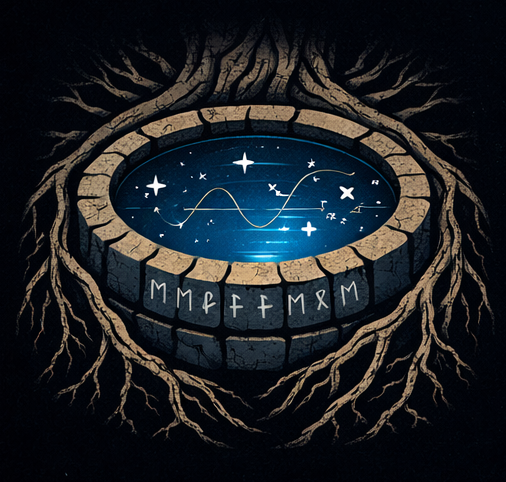

<div align="center">


# Mímisbrunnr — Mimir's Well: The Intuition Lab
**Building a "gut feeling" for abstract math and physics concepts through code.**

> "What I cannot create, I do not understand." — Richard Feynman

</div>

## 🔭 The Philosophy

The core mission of this repository is to bridge the gap between abstract formalism and concrete understanding.

While textbooks often focus on the mechanics of solving a problem, this project focuses on the **intuition** behind the solution. We use whatever computational tool is best for the job:

* **Simulations:** To see probability and chaos in action.
* **Visualizations:** To map complex functions and vector fields.
* **Symbolic Solving:** To derive equations and understand their structure.

The goal is to move from "following the rules" to "internalizing the behavior" of the system.

---

## 🌐 Interactive Companion Site

Many of the experiments in this repository have an accompanying **interactive visualisation** hosted at:

### **[sambit-giri.github.io/mimirs-well](https://sambit-giri.github.io/mimirs-well/)**

These are browser-based apps (JavaScript/WebGL) that let you explore algorithms and simulations without running any code locally. The source for these lives in the [`docs/`](./docs/) folder of this repository.

---

## 🧪 Experiments

| ID | Experiment | Key Concepts | Status |
| :--- | :--- | :--- | :--- |
| **01** | [**The Monty Hall Paradox**](./notebooks/01-monty-hall/) | `Probability` `Monte Carlo` `Game Theory` | ✅ Complete |
| **02** | [**Random Walks 1D/2D**](./notebooks/02-random-walks/) | `Stochastic Processes` `Diffusion` | 🚧 In Progress |
| **03** | ... | ... | ... |

---

## 📂 Repository Structure
```
mimirs-well/
├── notebooks/          # Jupyter notebooks — one folder per experiment
│   ├── 01-monty-hall/
│   ├── 02-random-walks/
│   └── ...
└── docs/               # Source for the interactive companion site
    └── ...             # JavaScript / web apps (served via GitHub Pages)
```

Each notebook experiment is self-contained inside the [`notebooks/`](./notebooks/) directory.

---

## 🛠️ Usage

### 1. Clone the repository
```bash
git clone https://github.com/sambit-giri/mimirs-well.git
cd mimirs-well
```

### 2. Set up the environment (Recommended)

It is best practice to use a virtual environment to avoid conflicting package versions. Several options exist, such as [venv](https://docs.python.org/3/library/venv.html), [conda](https://anaconda.org/), and [mamba](https://mamba.readthedocs.io/).

The example below assumes a Linux or Unix-based system and uses [venv](https://docs.python.org/3/library/venv.html).
```bash
python -m venv .venv
source .venv/bin/activate
```

### 3. Install dependencies
```bash
pip install -r requirements.txt
```

### 4. Run an experiment

Navigate to the experiment you want to explore and launch Jupyter.
```bash
# Example: the Monty Hall simulation
cd notebooks/01-monty-hall
jupyter notebook
```

---

## 📜 License

This project is licensed under the MIT License. You are free to use, modify, and distribute this software, provided that you include the original copyright and license notice.

---

> *In Norse mythology, Mímisbrunnr — the Well of Mimir — is the source of wisdom hidden beneath the roots of Yggdrasil. Odin sacrificed an eye to drink from it. Some concepts ask for almost as much.*
